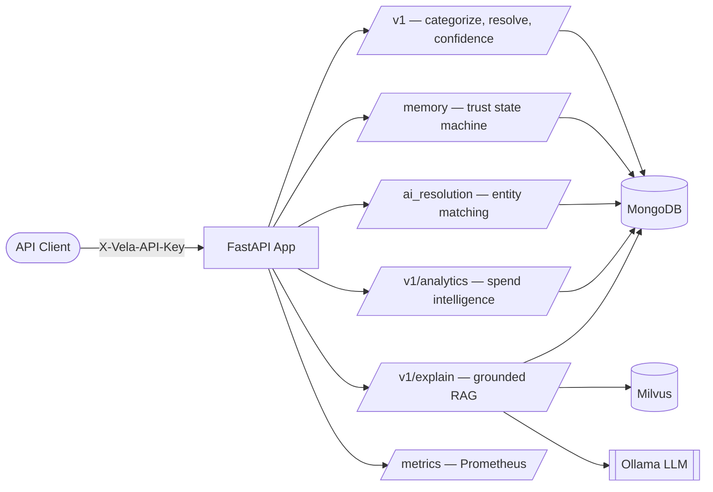
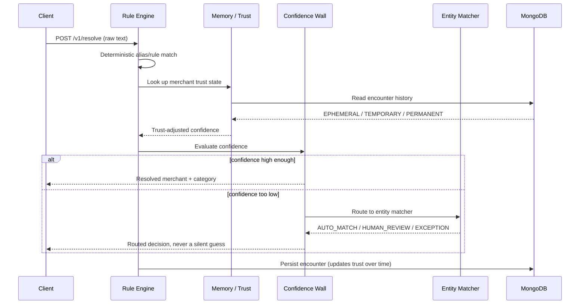

<div align="center">


# Vela

**Transaction Intelligence Engine — turning noisy financial text into explainable, structured insight.**

Vela ingests raw, messy transaction strings (UPI references, bank SMS, POS narrations) and turns them into canonical merchant identity, spend category, behavioral fingerprints, anomaly signals, and natural-language explanations — grounded in retrieved data, not guesswork.

[](https://www.python.org/)
[](https://fastapi.tiangolo.com/)
[](https://www.mongodb.com/)
[](https://milvus.io/)
[](https://flutter.dev/)
[](./.github/workflows/ci.yml)
[](https://www.docker.com/)

</div>

---

## Table of Contents

- [Overview](#overview)
- [Architecture](#architecture)
- [Request Flow](#request-flow)
- [Pipeline Phases](#pipeline-phases)
- [Features](#features)
- [Tech Stack](#tech-stack)
- [Repository Layout](#repository-layout)
- [Getting Started](#getting-started)
- [Testing](#testing)
- [CI/CD](#cicd)
- [Deployment](#deployment)
- [API Overview](#api-overview)
- [Known Limitations](#known-limitations)
- [Roadmap](#roadmap)
- [License](#license)

---

## Overview

Most transaction-categorization systems either rely on brittle string matching or hand the whole problem to a single opaque LLM call. Vela takes a different approach: a layered pipeline where each stage has a single, well-defined responsibility —

- **Deterministic rules** handle the obvious cases fast and cheaply.
- **A trust/memory state machine** means a merchant isn't treated as reliable the first time it's seen — trust is earned over repeated encounters.
- **A confidence wall** actively rejects low-confidence or out-of-vocabulary predictions rather than letting a bad guess pollute analytics — *"Unknown" is treated as a valid, honest answer.*
- **AI-assisted entity resolution** matches noisy bank records against canonical financial records, routing every decision into `AUTO_MATCH`, `HUMAN_REVIEW`, or `EXCEPTION` rather than forcing a binary yes/no.
- **A grounded RAG layer** explains categorizations in natural language, but is architecturally forbidden from answering unless it has real retrieved data to point to.

Vela is a single async FastAPI service backed by MongoDB (system of record) and Milvus (semantic vector search), with Ollama providing local/self-hosted embeddings and generation, plus a Flutter frontend under [`frontend/`](./frontend).

## Architecture



## Request Flow

How a single noisy transaction string becomes a categorized, trust-scored, explainable record:



## Pipeline Phases

Vela's own code comments describe the system as a sequence of numbered **phases** — this isn't a documentation invention, it's how the codebase actually labels itself:

| Phase | Capability | Status |
|---|---|---|
| 1–3 | Rule-based categorization + noisy-text merchant resolution | Working |
| 4 | Memory / trust state machine (`EPHEMERAL → TEMPORARY → PERMANENT`) | Working |
| 5 | Confidence wall (reject low-confidence predictions) | Working |
| 6 | Behavioral feature extraction (amount, timing, frequency, periodicity) | Working; trigger via `POST /v1/pipelines/behavior/run-all` |
| 7 | Embeddings + Milvus vector search | Working; trigger via `POST /v1/pipelines/embeddings/sync` |
| 8 | UMAP + HDBSCAN clustering | Working; trigger via `POST /v1/pipelines/clustering/run` |
| 9 | AI-assisted entity resolution (bank record ↔ canonical record matching) | Working — see [`ai_resolution/`](./ai_resolution) |
| 10 | Baseline ML model benchmarking | Script-only, synthetic data (real-data training is scoped future work) |
| 11 | Human feedback + active learning queue | Mounted at `POST /v1/feedback/`; retraining executor still pending (needs a task queue) |
| 12 | LoRA fine-tuning (FinBERT) | Script-only, synthetic data (real-data training is scoped future work) |
| 13 | Grounded RAG explainability | Working end-to-end |
| 14 | Spend analytics (patterns, subscriptions, trends, anomalies) | Working |
| 15 | Observability / drift monitoring | Stubbed — needs Evidently/MLflow integration (infra decision, not a bug) |
| 16 | API key authentication + rate limiting | Working — key is enforced, rate limit is live on `/v1/categorize` |

## Features

| Feature | Endpoint(s) | Status |
|---|---|---|
| Deterministic merchant/category rule matching | `POST /v1/categorize` | Stable |
| Noisy UPI/bank text → canonical merchant resolution | `POST /v1/resolve` | Stable |
| Confidence-wall prediction gating | `POST /v1/confidence/evaluate` | Stable |
| Merchant trust/memory state tracking | `POST /memory/update`, `GET /memory/profile/{name}`, `GET /memory/state/{name}` | Stable |
| AI-assisted entity resolution (record-to-record matching) | [`ai_resolution/matcher.py`](./ai_resolution/matcher.py) | Stable — see [`evaluation/`](./evaluation) for benchmark harness |
| Spend breakdown by category & top merchants | `GET /v1/analytics/patterns/*` | Stable |
| Subscription detection | `GET /v1/analytics/subscriptions` | Needs backfill — run `POST /v1/pipelines/behavior/run-all` first |
| Real-time anomaly detection (z-score) | `POST /v1/analytics/anomaly/check` | Needs backfill — run `POST /v1/pipelines/behavior/run-all` first |
| Month-over-month trend | `GET /v1/analytics/trends/mom` | Stable |
| Human feedback + active learning queue | `POST /v1/feedback/` | Stable (retraining executor still pending — see Known Limitations) |
| Batch pipelines (behavior, embeddings, decay, graph, clustering) | `POST /v1/pipelines/*` | Stable; manually triggered (no scheduler yet) |
| Grounded, hallucination-resistant explanations | `POST /v1/explain` | Stable |
| Health check & Prometheus metrics | `GET /health`, `GET /metrics` | Stable |

Legend: **Stable** — working correctly and verified · **Needs backfill** — works, but depends on a manual step

## Tech Stack

| Layer | Technology |
|---|---|
| API Framework | [FastAPI](https://fastapi.tiangolo.com/) + [Uvicorn](https://www.uvicorn.org/) |
| Frontend | [Flutter](https://flutter.dev/) ([`frontend/`](./frontend)) |
| Primary Database | [MongoDB](https://www.mongodb.com/) via [Motor](https://motor.readthedocs.io/) (async) |
| Vector Database | [Milvus](https://milvus.io/) via `pymilvus` |
| LLM / Embeddings | [Ollama](https://ollama.com/) (self-hosted inference) |
| Rate Limiting | [SlowAPI](https://github.com/laurentS/slowapi) |
| Metrics | [prometheus-fastapi-instrumentator](https://github.com/trallnag/prometheus-fastapi-instrumentator) |
| Classical ML | scikit-learn, LightGBM, XGBoost, SHAP |
| Deep Learning | PyTorch, HuggingFace Transformers, PEFT (LoRA) |
| Dimensionality Reduction / Clustering | UMAP, HDBSCAN |
| Graph Modeling | NetworkX |
| Configuration | Pydantic Settings (`.env`-driven) |
| Containerization | Docker, Docker Compose |
| Testing | pytest, FastAPI `TestClient` |
| Linting | ruff |
| CI | GitHub Actions (lint, test, dependency/secret/container scanning) |

## Repository Layout

```
Vela/
├── app.py                    # FastAPI entry point, lifespan, router mounting
├── core/                     # Config, security (auth), rate limiting, Ollama client
├── database/                 # MongoDB + Milvus connection singletons
├── models/                   # Shared Pydantic schemas & enums
├── routers/                  # HTTP controllers (v1, memory, analytics, rag, observability)
├── engines/                  # Rule engine + confidence wall
├── services/                 # Noisy-text merchant resolver
├── memory/                   # Trust state machine + decay engine
├── repositories/             # Data-access layer for merchant profiles
├── ai_resolution/            # AI-assisted entity matching (record-to-record)
├── features/                 # Statistical feature extractors
├── behaviour/                # Behavior-profiling orchestrator
├── embeddings/                # Text → vector generation
├── milvus/                   # Vector store insert/search
├── clustering/                # UMAP + HDBSCAN discovery pipeline
├── training/                  # Baseline ML + LoRA fine-tuning pipelines
├── evaluation/                 # Benchmarks, ground-truth datasets, qualification suite
├── feedback/                   # Human feedback + retraining queue
├── rag/                        # Grounded explainability pipeline
├── analytics/                  # Spend patterns, subscriptions, trends, anomalies
├── graphs/                     # Cross-collection knowledge graph (NetworkX)
├── statements/                 # Bank statement ingestion (PDF/CSV)
├── scripts/                    # Seed data, mock data, manual E2E smoke test
├── frontend/                   # Flutter client app
├── test_api.py                 # pytest suite
├── merchant_aliases.json       # Static rule-engine lookup table
├── Dockerfile
├── docker-compose_local.yaml
└── docker-compose_production.yaml
```

## Getting Started

### Prerequisites

- Python **3.12** (the `Dockerfile` is pinned to `python:3.12-slim`)
- [Docker](https://www.docker.com/) & Docker Compose (recommended path)
- A running **MongoDB** instance
- A running **Milvus** instance ([standalone Docker image](https://milvus.io/docs/install_standalone-docker.md) is sufficient for local dev)
- A reachable **Ollama** server with an embedding model and a generation model pulled

> **Note:** The committed `docker-compose_local.yaml` only provisions MongoDB — you'll need to run Milvus and Ollama separately (or add them to your own compose override) for the full feature set to work locally.

### Installation

```bash
git clone https://github.com/lokeshramchand-ctrl/Vela.git
cd Vela

python -m venv .venv
source .venv/bin/activate        # Windows: .venv\Scripts\activate

pip install -r requirements.txt
```

The `torch`/`transformers`/`peft`/`datasets` fine-tuning stack is included but only needed if you plan to run `training/finetune.py`; it's a large download, so skip it if you're just running the API.

### Environment Variables

Create a `.env` file in the project root:

```env
# MongoDB
MONGODB_URI=mongodb://localhost:27017
MONGODB_DB_NAME=Vela

# Milvus
MILVUS_URI=http://localhost:19530

# Ollama — set ONE of the following
OLLAMA_URI=http://localhost:11434
# OLLAMA_HOSTS=http://host1:11434,http://host2:11434   # comma-separated failover list

# Ollama models — replace with whatever models you've pulled in your own Ollama instance
EMBED_MODEL=nomic-embed-text
LLM_MODEL=llama3

# API authentication
Vela_API_KEY=your-secret-key-here
```

| Variable | Required | Default | Notes |
|---|---|---|---|
| `MONGODB_URI` | Yes | — | Full MongoDB connection string |
| `MONGODB_DB_NAME` | No | `Vela` | |
| `MILVUS_URI` | Yes | — | |
| `OLLAMA_URI` | No | — | Takes precedence over `OLLAMA_HOSTS` if both are set |
| `OLLAMA_HOSTS` | No | — | Comma-separated failover list, tried in order at startup |
| `EMBED_MODEL` | Yes | — | Ollama embedding model name |
| `LLM_MODEL` | Yes | — | Ollama generation model name |
| `Vela_API_KEY` | Yes | — | Enforced on every non-public route via `X-Vela-API-Key` |

The app **fails fast at startup** if any required variable is missing — this is deliberate, not a bug.

### Running Locally

**Option A — Docker Compose (MongoDB only; bring your own Milvus/Ollama):**
```bash
docker compose -f docker-compose_local.yaml up --build
```

**Option B — Manual:**
```bash
python scripts/seed.py                                   # optional: seed canonical merchant data
uvicorn app:app --reload --host 0.0.0.0 --port 8000
```

**Verify it's up:**

```bash
curl http://localhost:8000/health
```

Interactive API docs (auto-generated by FastAPI) are available at **http://localhost:8000/docs**.

### Frontend

```bash
cd frontend
flutter pub get
flutter run
```

## Testing

```bash
# Core API suite (requires live MongoDB + Milvus)
pytest test_api.py -v

# Full Track 04 qualification suite (unit, edge-case, Mongo integration,
# benchmark, baseline comparison, confidence-wall, failure-injection,
# performance, end-to-end, plus report generation)
make test-track04

# Manual, narrated end-to-end smoke test against a running server
bash scripts/test_pipeline.sh
```

The `pytest` suite uses FastAPI's `TestClient` against the real app object, so it genuinely exercises the app's `lifespan` (real database connections) rather than mocking them.

## CI/CD

Every push and PR to `main`/`master`/`frontend` runs through [`.github/workflows/ci.yml`](./.github/workflows/ci.yml):

- **Secret scanning** (gitleaks) — runs independently, first
- **Lint** (ruff) — see [`pyproject.toml`](./pyproject.toml) for the enabled rule set
- **Dependency vulnerability scan** (pip-audit) — production and training dependency sets
- **Tests** (pytest) — against a real `mongo:6.0` service container, including the full Track 04 suite
- **Frontend** (`flutter analyze` + `flutter test`)
- **Docker** — Dockerfile lint (hadolint) + image vulnerability scan (Trivy)

## Deployment

**Build and run with Docker:**

```bash
docker build -t vela-backend .
docker run -p 8000:8000 --env-file .env vela-backend
```

**Or via Compose** (`docker-compose_production.yaml` targets an external Coolify network — adapt for your own infrastructure):
```bash
docker compose -f docker-compose_production.yaml up -d --build
```

All production secrets (`MONGODB_URI`, `MILVUS_URI`, `EMBED_MODEL`, `LLM_MODEL`, `Vela_API_KEY`) are read from a compose `.env` file or your CI/host secret store — never hardcoded.

## API Overview

All endpoints except `/health` and `/metrics` require the header `X-Vela-API-Key`.

| Method | Endpoint | Purpose |
|---|---|---|
| `GET` | `/health` | Liveness + dependency status |
| `GET` | `/metrics` | Prometheus metrics |
| `POST` | `/v1/categorize` | Rule-based categorization |
| `POST` | `/v1/resolve` | Noisy-text → canonical merchant |
| `POST` | `/v1/confidence/evaluate` | Confidence-wall evaluation |
| `POST` | `/memory/update` | Record a merchant encounter |
| `GET` | `/memory/profile/{name}` | Fetch a merchant's full trust profile |
| `GET` | `/memory/state/{name}` | Fetch just trust state + frequency |
| `GET` | `/v1/analytics/patterns/categories` | Spend by category |
| `GET` | `/v1/analytics/patterns/merchants` | Top merchants by visits |
| `GET` | `/v1/analytics/subscriptions` | Detected recurring subscriptions |
| `GET` | `/v1/analytics/trends/mom` | Month-over-month spend trend |
| `POST` | `/v1/analytics/anomaly/check` | Real-time anomaly check |
| `POST` | `/v1/explain` | Grounded RAG explanation |
| `POST` | `/v1/feedback/` | Submit human correction feedback |
| `POST` | `/v1/pipelines/behavior/run`, `/run-all` | Run behavior profiling (one merchant / all) |
| `POST` | `/v1/pipelines/embeddings/sync` | Generate + store Milvus embeddings for behavior patterns |
| `POST` | `/v1/pipelines/decay/sweep` | Archive stale (180+ day) merchant profiles |
| `POST` | `/v1/pipelines/graph/build` | Rebuild the in-memory knowledge graph |
| `GET` | `/v1/pipelines/graph/neighborhood/{merchant_name}` | Ego-graph around a merchant |
| `POST` | `/v1/pipelines/clustering/run` | Run the UMAP + HDBSCAN discovery pipeline |
| `POST` | `/v1/observability/drift/analyze` | Drift analysis (stub) |
| `GET` | `/v1/observability/reports/latest` | Latest drift report (stub) |

**Example interaction:**

```bash
$ curl -s -X POST http://localhost:8000/v1/resolve \
    -H "X-Vela-API-Key: your-secret-key-here" \
    -H "Content-Type: application/json" \
    -d '{"text": "UPI/CR/3152671239/BUNDL TECHNOLOGIES/HDFC"}'
```

```json
{
  "raw_text": "UPI/CR/3152671239/BUNDL TECHNOLOGIES/HDFC",
  "cleaned_text": "BUNDL TECHNOLOGIES",
  "canonical_merchant": "Swiggy",
  "confidence": 0.99,
  "is_resolved": true,
  "resolution_method": "exact_alias"
}
```

## Known Limitations

Vela is transparent about its own maturity:

- **The retraining queue has no executor.** Corrections accumulate and get marked `"processing"` once the threshold is hit, but nothing actually retrains a model yet — that needs a task queue (Celery + broker).
- **`training/train.py` and `training/finetune.py` train on synthetic data**, not real feedback/transaction data — their docstrings describe the intended MongoDB queries, but that data-assembly pipeline isn't built yet.
- **Observability endpoints are stubs** — no Evidently AI / MLflow integration exists yet.
- **No caching layer yet** — nothing in current traffic patterns demonstrably needs one; MongoDB indexes exist, a cache is separate follow-up work once a real hot path is measured.
- **The `/v1/pipelines/*` endpoints are manually triggered** — nothing schedules them yet (no cron/Celery beat in this repo).
- **No per-caller authorization** — every request bearing the single shared `Vela_API_KEY` gets identical access; real multi-tenancy is a scoped feature, not a hardening tweak.

## Roadmap

- [ ] Stand up a task queue (Celery + broker) and wire the retraining executor to it
- [ ] Build a real MongoDB-backed training data pipeline for `training/train.py` and `training/finetune.py`
- [ ] Schedule `/v1/pipelines/*` (behavior, embeddings, decay, graph, clustering) on a cron/Celery beat instead of manual triggers
- [ ] Wire real Evidently AI / MLflow observability instead of the current stubs
- [ ] Add a LICENSE
- [ ] Introduce a caching layer once a real hot query pattern is measured
- [ ] Real multi-tenancy: per-caller API keys with actual scoping, instead of one shared key

## License

**No license file is currently present in this repository.** Until one is added, all rights are reserved by default under standard copyright law.

---

<div align="center">

Built as a demonstration of layered, explainable financial ML architecture.

</div>
